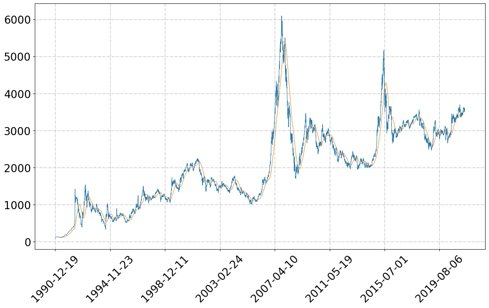
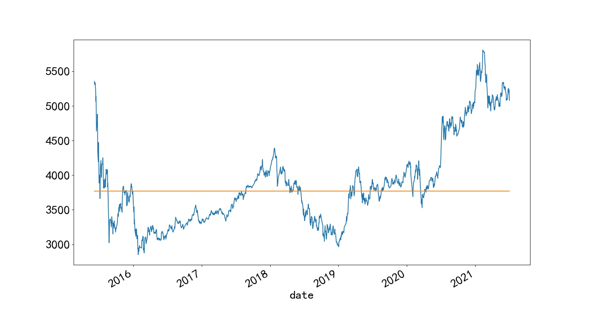

安装环境参考https://github.com/pynote/investnote
### 1. 指数走势
>python trend_of_sh000001.py

### 2. 年化收益率计算
>python return_of_sh000300.py

>我是老涂，关注我的微信公众号 **老涂数据投研(py_invest_note)** ，输入**210704**，获取该代码的详细解释。
> 
>