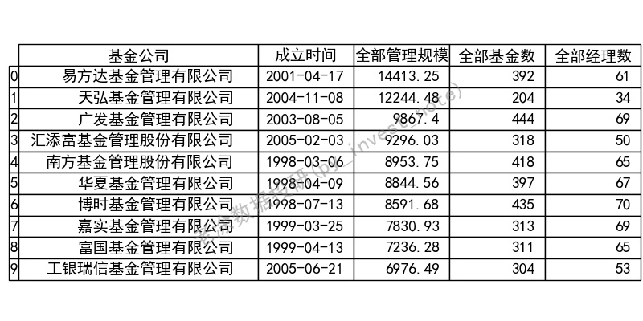
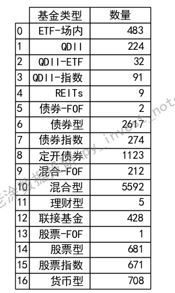
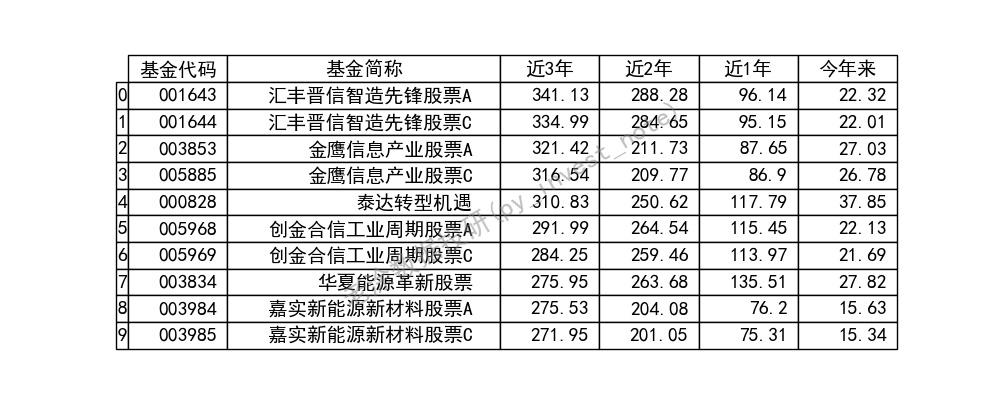
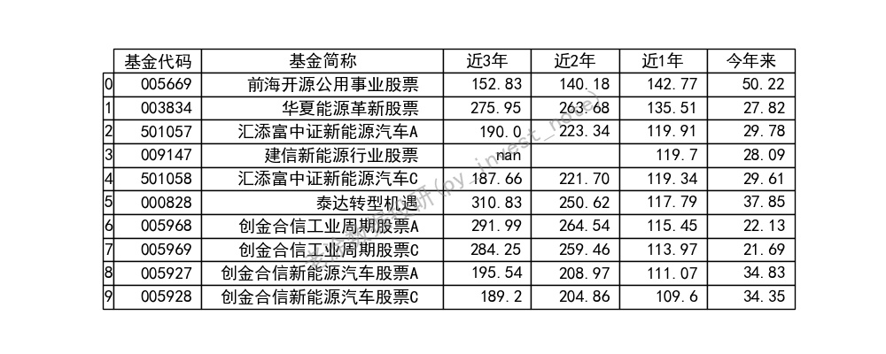
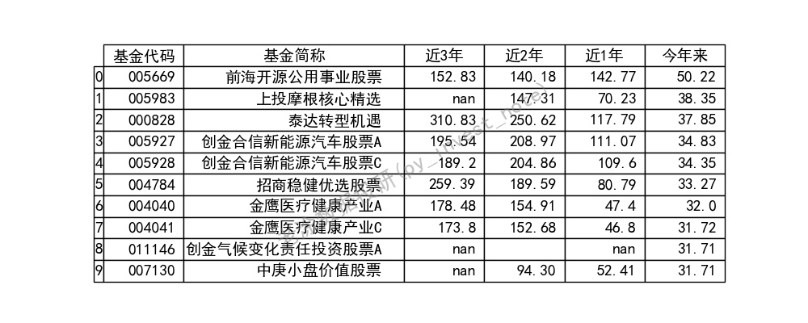
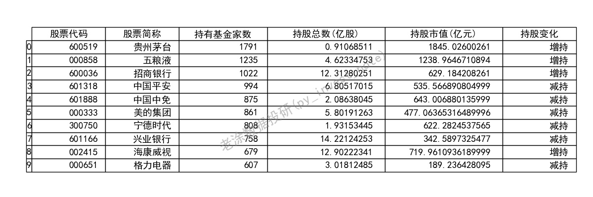

安装环境参考https://github.com/pynote/investnote

**首次运行后，将会缓存数据文件，若需获取实时数据，将文件夹下.pkl文件删除即可。**
### 1. 基金大盘点
>python fund_info.py

规模前10

基金类型

近3年收益前10

近1年收益前10

今年来收益前10

### 2. 基金重仓股

>我是老涂，关注我的微信公众号 **老涂数据投研(py_invest_note)** ，输入**210706**，获取该代码的详细解释。
> 
>