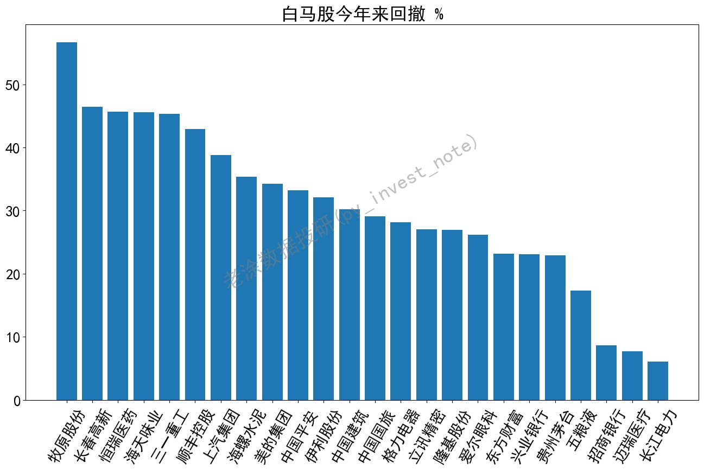
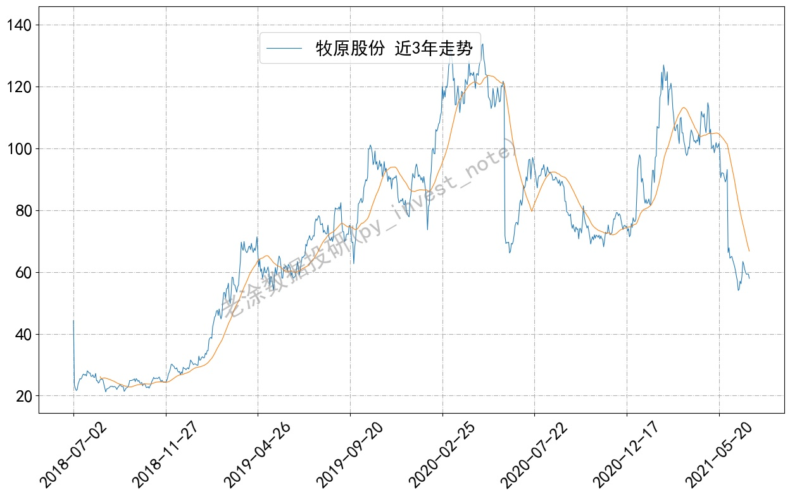
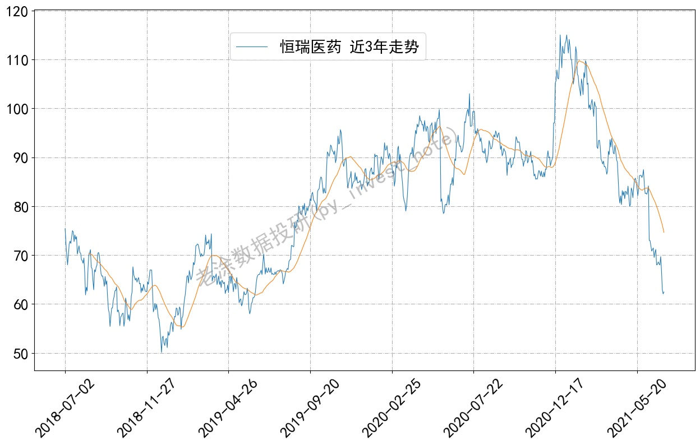
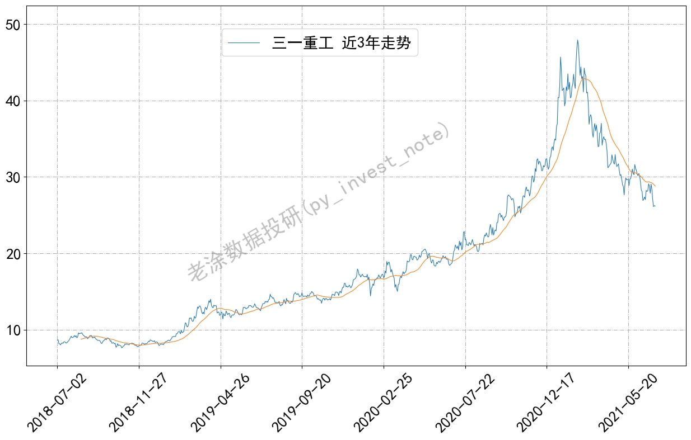
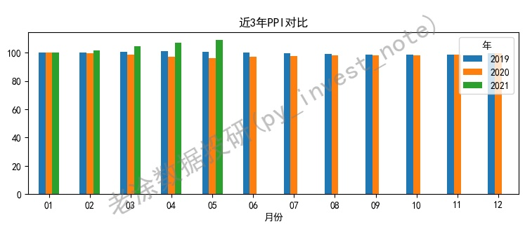

安装环境参考https://github.com/pynote/investnote

**首次运行后，将会缓存数据文件，若需获取实时数据，将文件夹下.pkl文件删除即可。**
### 1. 大白马走势
>python trend.py
>
>python retreat.py

今年来回撤

一些白马股走势

### 2. 大白马为何跌跌不休
>python ppi.py

>我是老涂，关注我的微信公众号 **老涂数据投研(py_invest_note)** ，输入**210707**，获取该代码的详细解释。
> 
>