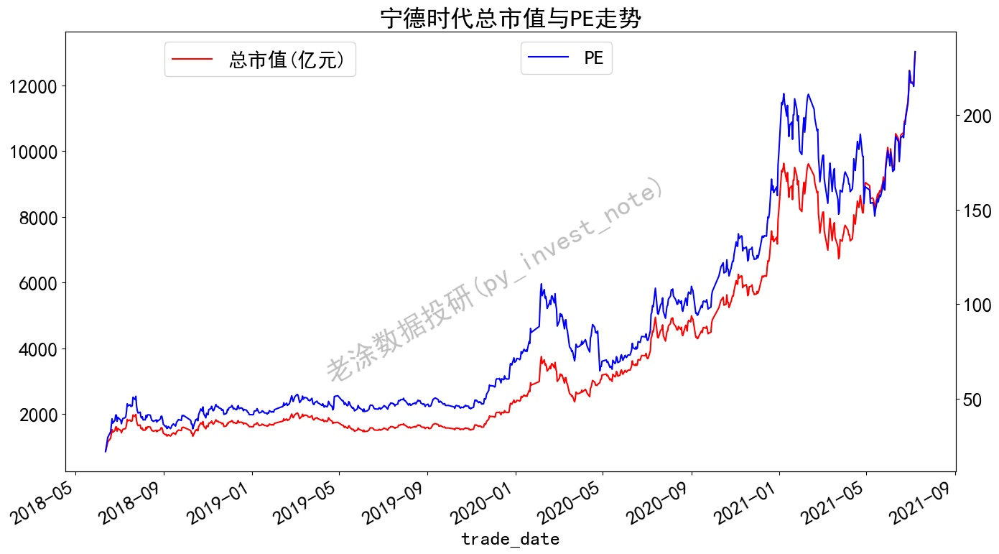

安装环境参考https://github.com/pynote/investnote

**首次运行后，将会缓存数据文件，若需获取实时数据，将文件夹下.pkl文件删除即可。**
### 1. 市盈率PE(静态、动态、TTM)

### 2. 实例计算
>python pe.py
>
>python finance.py

格力电器

### 3. 为什么3家公司的估值大相径庭

### 4. 用发展的眼光看问题

>我是老涂，关注我的微信公众号 **老涂数据投研(py_invest_note)** ，输入**210709**，获取该代码的详细解释。
> 
>