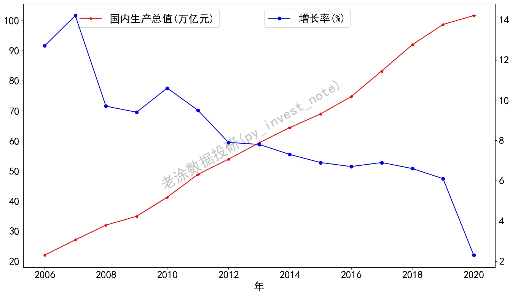
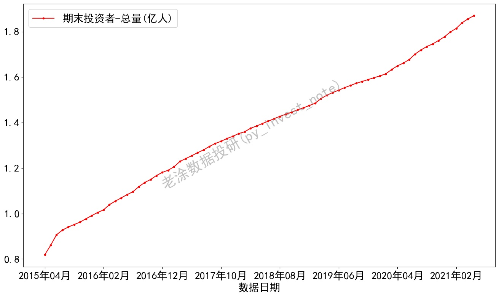
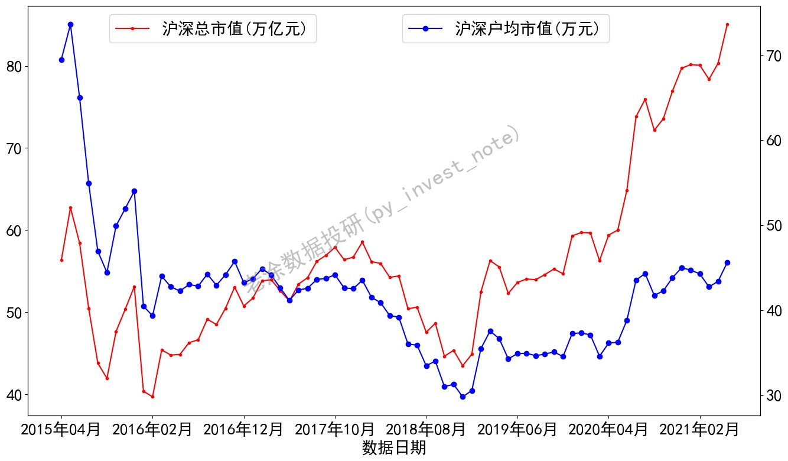

安装环境参考https://github.com/pynote/investnote

**首次运行后，将会缓存数据文件，若需获取实时数据，将文件夹下.pkl文件删除即可。**
### 1. 中美GDP对比
>python gdp.py

### 2. 中美资本市场对比
>python investor.py

>我是老涂，关注我的微信公众号 **老涂数据投研(py_invest_note)** ，输入**210710**，获取该代码的详细解释。
> 
>